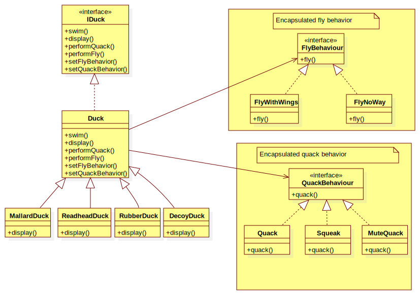

### Strategy pattern (policy pattern)

- A behavioral software design pattern
- Define a family of algorithms, encapsulate each one, and make them interchangeable. Strategy lets the algorithm vary independently from the clients that use it.
- Capture the abstraction in an interface, bury implementation details in derived classes.

