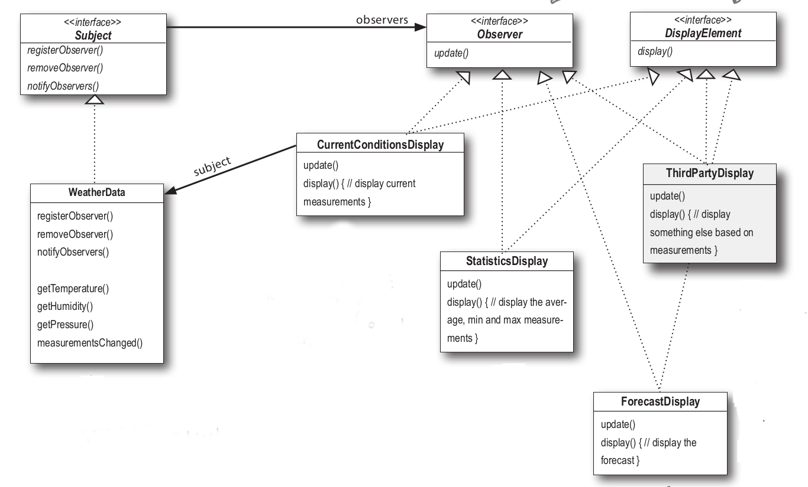

### Observer pattern

- Publishers + Subscribers = Observer Pattern
- The Observer Pattern defines a one-to-many dependency between objects so that when one object changes state, all of its dependents are notified and updated automatically. 
- The Observer Pattern defines a one-to-many relationship between a set of objects. When the state of one object changes, all of its dependents are notified.

